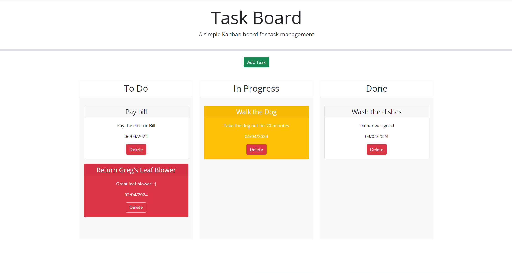

# Employee Payroll Tracker

## Description

This page allows you to make a task and show it on the screen with a card with title, description, and due date. The task will change color based on when the task is due. The task can also be moved from To Do list to the In progress list and finaly to the done list. Each task will also have a delete button when your done a task.

## Link to page

[Live site here!](https://giovanni-ramirez.github.io/Task-board/)

## Features
- Make a task card with Title, Description, and Due Date
- Task will change color based on when the task is Due
- Task can be moved to other status
- Task can be deleted when complete

## Screen shot

